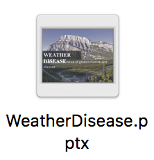

# <a href="http://4xtw.tk/index.html">WebSite</a>  ------>Click to Visit our Website
# Team
>Team 
>* Weather Disease
>
>Project 
>* Dengue helper
>
>Member 
>* Luo Ye Chen, Tsai Yi Lin, Wang Shih Cheng

# Introduce
>Subject：How is  relationship between climatic factors and infectious diseases?
>
>Problem & Solution : 
We mainly collect weather and infectious diseases from Taiwan and other neighboring countries. 
Such as: dengue fever, zawa ... 
Explore and analyze whether the weather factor. 
For example: the heavy rain and high temperature caused the disease and the greenhouse effect and the Christ Child brought to the earth's disease accomplice. 
One by one to OpenData visualization of the way to allow users to know which several climatic factors led to the outbreak of the disease, and to prevent in advance.

# App (Dengue helper)

In our application we use open data provited by the government and you can use it from anywhere.

## Feature:
> * ####  Global real-time weather : 
>   Temperature, Wind speed and direction, Atmospheric and Air pressure, Astronomy, Weather forecast.
> * ####  Real-time disease news : 
>   Including Taiwan dengue fever news and World Health Organization(WHO) disease news,and you can check world disease disaster news before you travel abroad.
> * ####  Global map : 
>   Global temperature map、Global dengue map、Global humidity map.
> * ####  Taiwan dengue map : 
>   The number of Taiwan dengue fever ,and region occur in anywhere.
> * #### Dengue fever prevention : 
>   Dengue knowledge and simple check whether you live in danger.

# Weather Disease Web

-----
## Index

* ### Introduction for team and issue

## Analysis of Dengue in Taiwan

> * ### Chart present monthly dengue cases statistics in 2006 to 2016 
>   this chart present monthly dengue cases statistics in 2006 to 2016 , we can find dengue cases are increased yearly ,  
our team will find out what is mtter of dengue cases are increased yearly
>
> * ###  Chart of monthly rainfall and dengue cases in 2012 to 2016 from tainan
>   it is chart of monthly rainfall and dengue cases in 2012 to 2016 from tainan, 
we can find when this month have havey rain and dengue case were be increased 
so we can get a conclusion is wet environment outbreak dengues easily
>
> * ###  Chart of  Monthly average temperature 
>   we compare both Monthly average temperature in 1897-1945 and 2012 to 2016 from CMB data in tainan ,
and we can Observed  Monthly average temperature in 2012 to 2016 most heigher than Monthly average temperature in 1897-1945 and we can find that the temperture is warmer than before.
and therefoce increased the time for mosquito breeding
>
> * ### Trends of dengue in Taiwan
>   we can access dengue cases  in recent weeks
>
> * ### Dengue Map in Taiwan
>   we can access area which was outbreak denguein taiwan
>
> * ### Dengue Map in th World
>   thia map appear area which report dengue news in global and more red point is 
represent  spread  more seriously
>
> * ### Map of Global Warming
>   we can compare both global dengue map and global climate map 
and we can find which area were dengue spread more seriously 
and also a high temptrue and humidity area

## Visualize Data
>data for visaulize chart
>
> * ### monthly rainfall in 2012 - 2016 intainan
> * ### temperature variety in 1897 and 2012-2016
> * ### monthly dengues case in tainan 2012-2016  for visaulize

----

# Data set:
## Taiwan's OpenData
> ### ▶ Climate 
> * #### Central Weather Bureau - open platform
>   source：[交通部中央氣象局-開放資料平臺](http://opendata.cwb.gov.tw/index;jsessionid=3BB0B0B9FF230AE3F25A515C218C140A)
> * #### Monthly average temperature in 1897-1945 in taiwan
>   source：[歷年分月平均氣溫](http://twstudy.iis.sinica.edu.tw/twstatistic50/Climate.htm)
> * #### Observation data from Observatory in Taiwan in 2008-2016
>   source：[一年觀測資料-局屬地面測站觀測資料](http://opendata.cwb.gov.tw/catalog?group=c&dataid=B0024-002)
> ### ▶ Disease 
>* #### Taiwan CDC Open Data Portal
>   source：[衛生福利部疾病管制署資料開放平臺](https://data.cdc.gov.tw/dataset/aagstable-dengue)
>* #### dengue cases in taiwan in 2003-2016
>   source：[地區年齡性別統計表-登革熱](http://data.gov.tw/node/6879)
> ### ▶ Dengue fever news 
>* #### Taiwan CDC dengue fever news
>   source：[台灣衛生福利部疾病管制署登革熱即時新聞](http://www.cdc.gov.tw/professional/list.aspx?did=641&treeid=6FD88FC9BF76E125&nowtreeid=283F5B5821AF305B)
>* #### international travel diease leacel table
>   source：[國際間旅遊疫情建議等級表](http://www.cdc.gov.tw/countryepidlevel.aspx?treeid=aa2d4b06c27690e6&nowtreeid=4dd5edd98f8580aa)

## Global OpenData
> ### ▶ Disease news 
> * #### WHO World Health Organization - the latest global outbreak of the news
>   source：[Chinese](http://www.who.int/feeds/entity/csr/don/en/rss.xml) 
>   source：[English](http://www.who.int/feeds/entity/csr/don/zh/rss.xml)
>* #### Centers for disease control and prevention(CDC)
>   source：[Travel Health Notices](https://wwwnc.cdc.gov/travel/notices)
> ### ▶ Climate 
>* #### Yahoo Weather(real-time data)
>   source：[Yahoo Weather API](https://developer.yahoo.com/weather/)
>
>
> ### ▶ Other data quotes from external 
> * #### data:[DengueMap](http://www.healthmap.org/dengue/en/)
> * #### data:[earth :: a global map of wind, weather, and ocean conditions](https://earth.nullschool.net/zh-cn/#current/wind/surface/level/overlay=temp/grid=on/winkel3=49.54,-3.99,298)

## Reference data
> * [Dengue and Climate (CDC)](https://www.cdc.gov/dengue/entomologyecology/climate.html)
> * [從大數據看登革熱事件！](http://group.dailyview.tw/2015/10/21/%E5%BE%9E%E5%A4%A7%E6%95%B8%E6%93%9A%E7%9C%8B%E7%99%BB%E9%9D%A9%E7%86%B1%E4%BA%8B%E4%BB%B6/)
> * [義守大學新聞文檔](http://www.isu.edu.tw/upload/04/7/news/postfile_46241.pdf)
> * [衛生福利部疾病管制署](http://www.cdc.gov.tw/diseaseinfo.aspx?treeid=8d54c504e820735b&nowtreeid=dec84a2f0c6fac5b&tid=77BFF3D4F9CB7982)
> * [Facepalm icon credits](https://icons8.com/icon/12128/Facepalm)
> * [Designed by Freepik](http://www.freepik.com/free-vector/happy-kids-illustration_828943.htm)

## DownLoad

DownLoad PPT

DownLoad Dengue helper
